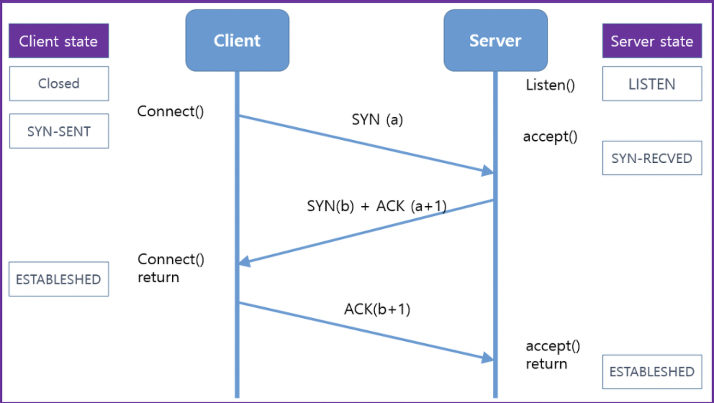

# ddos_syn_flood
개인공부 용/ python으로 구현한 syn_flood 방식

## SYN Flood란?

SYN 플러드는 공격자가 연결을 완료하지 않고 서버에 대한 연결을 빠르게 시작하는 서비스 거부 공격의 한 형태입니다.
서버는 절반이 열린 연결을 기다리는 데 리소스를 소비해야하므로 시스템이 정상적인 트래픽에 응답하지 않도록 충분한 리소스를 사용할 수 있습니다. - WIKIPEDIA

즉 TCP통신을 위해선 3-way-handshake 를 사용하는데, 정상적인 방법이라면 아래와 같은 사진으로 통신하게 된다.

SYN은 접속요청메시지, ACK는 수락확인이다.

SYN Flood는 

1. 서버에 SYN요청을 보냄

2.서버가 공격자에게 SYN,ACK를 보냄

3.공격자는 ACK를 보내지 않음으로써 서버는 Backlog Queue에 정보 저장후 대기중

이 과정을 사용한 일종의 DDOS공격이다.

즉 SYN Backlog Queue에는 클라이언트 측에서 응답이 없어서 계속 쌓여가 Backlog Queue가 꽉차게 되어, 서버측에서 새로운 통신요청을 받지 못하게 된다.

여기서 사용한 Scapy는 네트워크 패킷을 보내고, 훔치고, 위조할수 있는 패킷이다.

Scapy를 통해서 지속적으로 목적지에 SYN를 보내는 python code이다.
